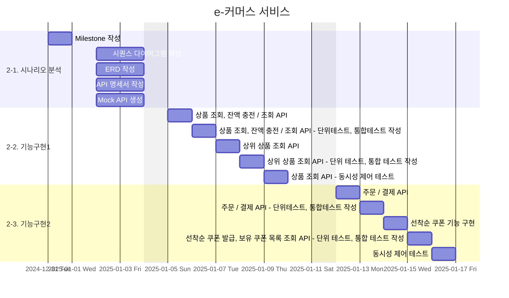

```mermaid
gantt
    title e-커머스 서비스
    axisFormat %Y-%m-%d %a
    excludes saturday
    section 2-1. 시나리오 분석
        Milestone 작성: 2024-12-31, 1d
        시퀀스 다이어그램 작성: 2025-01-02, 2d
        ERD 작성: 2025-01-02, 2d
        API 명세서 작성: 2025-01-02, 2d
        Mock API 생성: 2025-01-02, 2d
    section 2-2. 기능구현1
        상품 조회, 잔액 충전 / 조회 API: 2025-01-05, 1d
        상품 조회, 잔액 충전 / 조회 API - 단위테스트, 통합테스트 작성: 2025-01-06, 1d
        상위 상품 조회 API: 2025-01-07, 1d
        상위 상품 조회 API - 단위 테스트, 통합 테스트 작성: 2025-01-08, 1d
        상품 조회 API - 동시성 제어 테스트: 2025-01-09, 1d
    section 2-3. 기능구현2
        주문 / 결제 API: 2025-01-12, 1d
        주문 / 결제 API - 단위테스트, 통합테스트 작성: 2025-01-13, 1d
        선착순 쿠폰 기능 구현: 2025-01-14, 1d
        선착순 쿠폰 발급, 보유 쿠폰 목록 조회 API - 단위 테스트, 통합 테스트 작성: 2025-01-15, 1d
        동시성 제어 테스트: 2025-01-16, 1d
```