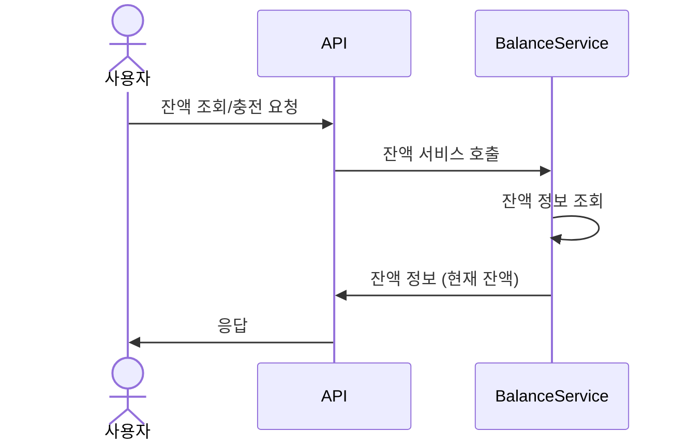
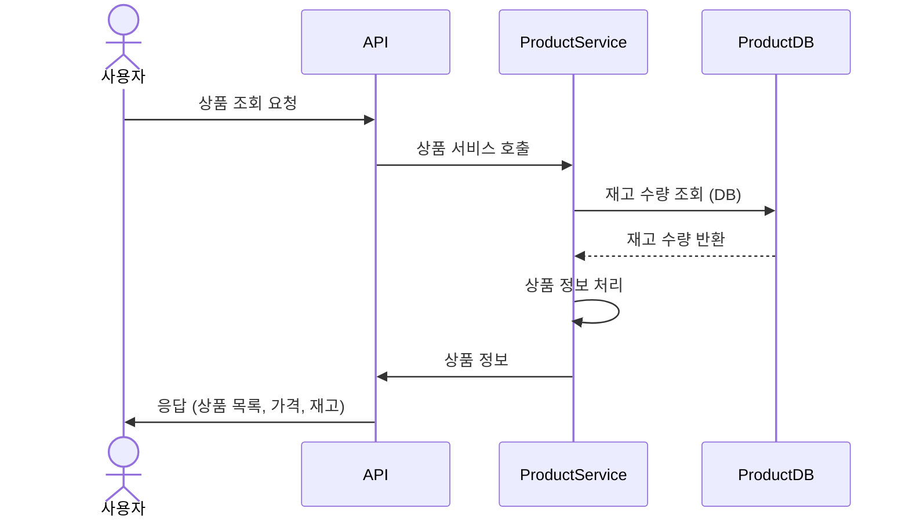
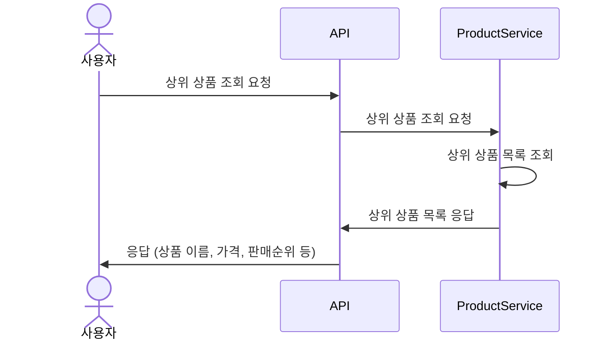
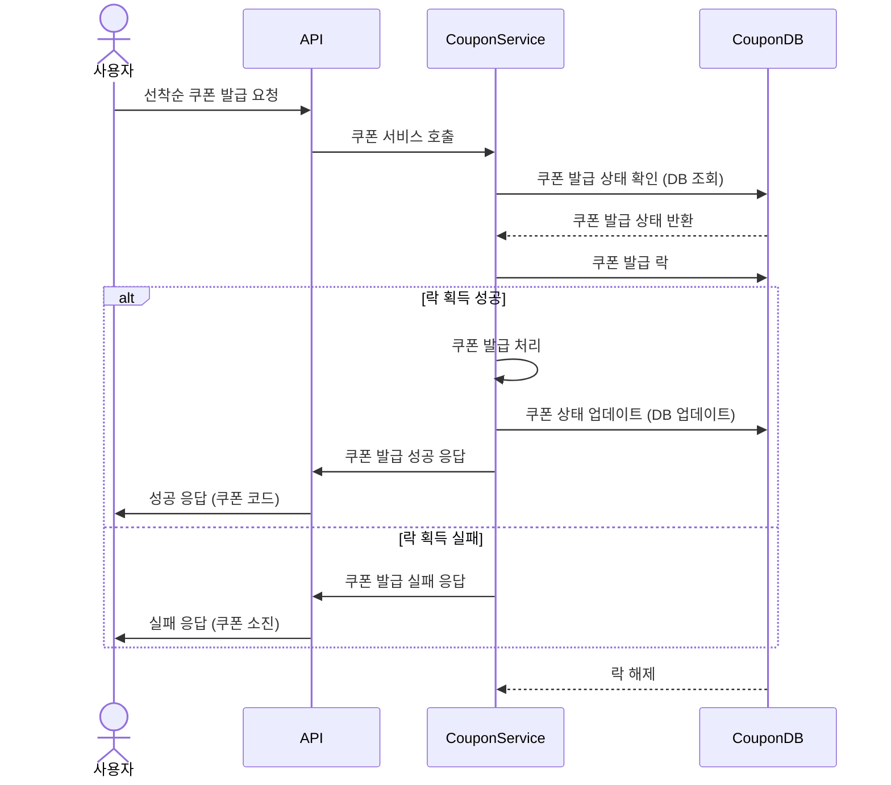
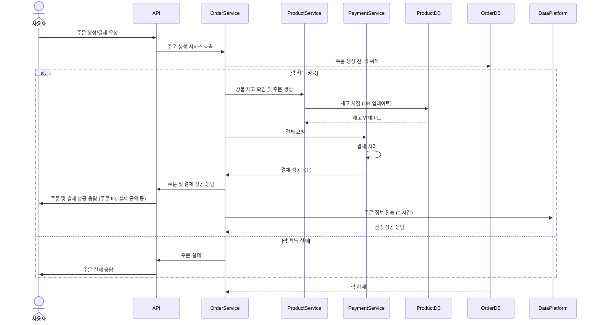

### 잔액 충전/조회 API

```mermaid
sequenceDiagram
    actor User as 사용자
    participant API
    participant BalanceService

    User->>API: 잔액 조회/충전 요청
    API->>BalanceService: 잔액 서비스 호출
    BalanceService->>BalanceService: 잔액 정보 조회
    BalanceService->>API: 잔액 정보 (현재 잔액)
    API->>User: 응답
```

### 상품 조회 API

```mermaid
sequenceDiagram
    actor User as 사용자
    participant API
    participant ProductService
    participant ProductDB

    User->>API: 상품 조회 요청
    API->>ProductService: 상품 서비스 호출
    ProductService->>ProductDB: 재고 수량 조회 (DB)
    ProductDB-->>ProductService: 재고 수량 반환
    ProductService->>ProductService: 상품 정보 처리
    ProductService->>API: 상품 정보
    API->>User: 응답 (상품 목록, 가격, 재고)
```

### 상위 상품 조회 API

```mermaid
sequenceDiagram
    actor User as 사용자
    participant API
    participant ProductService

    User->>API: 상위 상품 조회 요청
    API->>ProductService: 상위 상품 조회 요청
    ProductService->>ProductService: 상위 상품 목록 조회
    ProductService->>API: 상위 상품 목록 응답
    API->>User: 응답 (상품 이름, 가격, 판매순위 등)
```

### 선착순 쿠폰 발급 API

```mermaid
sequenceDiagram
    actor User as 사용자
    participant API
    participant CouponService
    participant CouponDB
    
    User->>API: 선착순 쿠폰 발급 요청
    API->>CouponService: 쿠폰 서비스 호출
    CouponService->>CouponDB: 쿠폰 발급 상태 확인 (DB 조회)
    CouponDB-->>CouponService: 쿠폰 발급 상태 반환
    CouponService->>CouponDB: 쿠폰 발급 락
    
    alt 락 획득 성공
        CouponService->>CouponService: 쿠폰 발급 처리
        CouponService->>CouponDB: 쿠폰 상태 업데이트 (DB 업데이트)
        CouponService->>API: 쿠폰 발급 성공 응답
        API->>User: 성공 응답 (쿠폰 코드)
    else 락 획득 실패
        CouponService->>API: 쿠폰 발급 실패 응답
        API->>User: 실패 응답 (쿠폰 소진)
    end
    CouponDB-->>CouponService: 락 해제
```
### 주문/결제 API

```mermaid
sequenceDiagram
    actor User as 사용자
    participant API
    participant OrderService
    participant ProductService
    participant PaymentService
    participant ProductDB
    participant OrderDB
    participant DataPlatform

    User->>API: 주문 생성/결제 요청
    API->>OrderService: 주문 생성 서비스 호출
    OrderService->>OrderDB: 주문 생성 전, 락 획득
    
    alt 락 획득 성공
        OrderService->>ProductService: 상품 재고 확인 및 주문 생성
        ProductService->>ProductDB: 재고 차감 (DB 업데이트)
        ProductDB-->>ProductService: 재고 업데이트
        OrderService->>PaymentService: 결제 요청
        PaymentService->>PaymentService: 결제 처리
        PaymentService->>OrderService: 결제 성공 응답
        OrderService->>API: 주문 및 결제 성공 응답
        API->>User: 주문 및 결제 성공 응답 (주문 ID, 결제 금액 등)

        %% 주문 정보 외부 데이터 플랫폼 전송
        OrderService->>DataPlatform: 주문 정보 전송 (실시간)
        DataPlatform-->>OrderService: 전송 성공 응답
    else 락 획득 실패
        OrderService->>API: 주문 실패
        API->>User: 주문 실패 응답
    end
    OrderDB-->>OrderService: 락 해제

```
